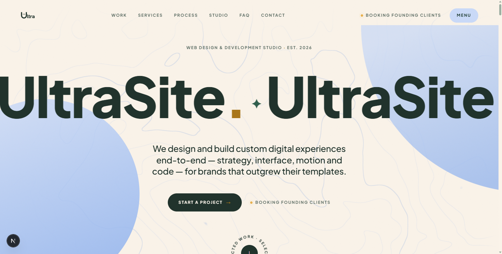

<p align="center"></p>

# UltraSite — Studio Portfolio (Light Edition)

A handmade studio portfolio built to sell premium web work — UltraSite, founded by Mohamad Masri & Khalil Badawi. Next.js 16 (App Router), Tailwind v4, Motion, Lenis, and a zero-dependency WebGL contour shader.

```bash
npm install
npm run dev      # http://localhost:3000
npm run build    # static production build
```

## Design system in one paragraph

A warm modular studio language: **cream** paper ground, **deep pine** display type, soft **periwinkle** geometry (gradient discs, pills, chips), and one **warm gold** spark. Two material states — `paper` (cream, the resting default) and `ink` (pine moments: Studio, Contact, Footer) — flip document-wide as chapters cross mid-viewport. Two typefaces: **Plus Jakarta Sans** (display and the caps label voice) and **Hanken Grotesk** (body). Everything is a pill or a rounded plate; structure is friendly, centered eyebrows over big sentence-case headlines. The signature tech layer survives from v1: the hero's interactive WebGL contour field ([ContourField.tsx](src/components/gl/ContourField.tsx)), drifting depth particles behind Studio, tilt-reactive case covers, and a marquee'd wordmark hero with a rotating badge.

All tokens live in [globals.css](src/app/globals.css) `:root` / `[data-theme="ink"]`. Components only read the semantic vars (`--bg`, `--fg`, `--muted`, `--line`, `--accent`, `--accent-2`, `--panel`), so a future brand palette is a one-file change.

## Replacing placeholder content

Everything editable lives in `src/data/`:

| File | Contents |
|---|---|
| [site.ts](src/data/site.ts) | Studio name, founders, email, location, availability, socials, domain |
| [projects.ts](src/data/projects.ts) | Case studies — currently the three in-house portfolio editions (Light, Dark, Storytelling) standing in as UltraSite's experience until client work ships |
| [content.ts](src/data/content.ts) | Services, process steps, stack, principles, studio manifesto |
| [voices.ts](src/data/voices.ts) | Founders' letters (a sheet is reserved for the first client) and the FAQ |

Marked `PLACEHOLDER` where the copy is invented. Project covers are generative SVG drawings ([ProjectCover.tsx](src/components/ui/ProjectCover.tsx)) keyed by each project's `seed`/`cover`/`tint` — swap for real imagery per project when it exists. The "portrait" in Studio is a spec plate; replace with a photograph when ready.

## Architecture

```
src/
  app/               routes, fonts, metadata, sitemap/robots, 404
  components/
    gl/              ContourField — raw WebGL renderer (~6KB, no three.js)
    layout/          Preloader, Nav, Cursor, Footer
    providers/       SiteFrame — Lenis scroll + chapter→theme observer
    sections/        Hero, Work, Services, Process, Studio, Contact
    ui/              Reveal (word masks), Magnetic, SectionHead, covers, clock
  data/              all replaceable content
  lib/               easing vocabulary, ready-state store, hooks
```

## Touch is a first-class pointer

Every desktop delight has a touch-native equivalent — nothing simply disappears on phones:

| Desktop | Phone |
|---|---|
| Cursor pressure deforms the contour field | Finger drags deform it; while scrolling, pressure follows scroll velocity on a slow orbit |
| Hover activates work rows (scale, accent, arrow) | Crossing the viewport's center band activates the same choreography — scrolling is the hover |
| Magnetic pull on buttons | Spring press + haptic tick (where supported); instant `:active` fills replace hover fills |
| Sticky numeral rail in Process | Sticky phase strip with live ticks |

Mechanics to preserve: `lib/scroll-lock.ts` is the only correct way to freeze the page (iOS ignores `overflow: hidden`, and Lenis clamps restores against a collapsed page height — the util handles both). Safe-area insets are wired through `viewportFit: "cover"` + `env()` paddings in the container, nav, menu, and footer. The shader drops to 3 fbm octaves and a 1.35 DPR cap on coarse pointers.

Conventions worth keeping:

- **One easing language** — [ease.ts](src/lib/ease.ts). Don't invent curves per component.
- **Chapters** — sections declare `data-chapter="ink|paper"`; [SiteFrame](src/components/providers/SiteFrame.tsx) morphs the whole document theme as they cross mid-viewport.
- **Motion discipline** — entrances are masked word-rises and quiet fades; everything respects `prefers-reduced-motion` (Lenis off, shader static, reveals skipped).
- **Cursor verbs** — add `data-cursor="view"` to any element to change the custom cursor's behavior over it.
- **Performance** — no raster images anywhere; the shader idles at zero when offscreen; fonts are subset variable fonts via `next/font`. Keep it that way.

## Deploying

Static output, deploys anywhere. For Vercel: `npm i -g vercel && vercel`. Set the real domain in [site.ts](src/data/site.ts) (`url`) so OG/sitemap/JSON-LD resolve correctly.

